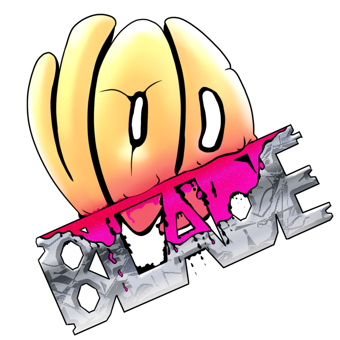

  

# VOD BLADE

Turns a Twitch VOD into a set of DaVinci-Resolve-ready highlight clips automatically,
by finding chat-hype spikes, loud audio moments, and notable sound events across the
stream, then (optionally) using a local AI model to judge which moments are actually
worth clipping and pick precise in/out points.

> **AI disclosure:** this project was built through extensive collaboration with
> Claude (Anthropic's AI) - design decisions, implementation, debugging, and testing
> were all directed and reviewed by the author throughout, but Claude wrote and tested
> most of the actual code. This is also reflected directly in the commit history via
> `Co-Authored-By: Claude Sonnet 5` trailers.

## What it does

- Reads a stream's subtitle/transcript track (YouTube captions or a local
  `.srt`/`.vtt`/`.txt`) alongside its Twitch chat log, and finds where chat activity
  spiked.
- Optionally analyzes the VOD's own audio for loud moments and specific sound events
  (laughter, alarms, etc.) as additional signals, independent of chat.
- Optionally runs each candidate moment through a local AI model ("AI Arbitration")
  to filter out false positives, tighten the clip boundaries, and generate a title and
  summary.
- Reviews candidates in a browser UI, with per-clip accept/reject and a "heart" marking
  system for quick triage.
- Exports the final selection straight into DaVinci Resolve, or as a standalone
  FCPXML/EDL file for any editor that can import one.

## Requirements

- Windows.
- **DaVinci Resolve** (optional) - only needed for direct timeline injection; the
  FCPXML/EDL export works without it.
- **Ollama** (optional) - only needed for AI Arbitration. The app can install it and
  pull the model for you from the Settings panel; needs an NVIDIA GPU with roughly 9GB+
  VRAM for the default model. Without it, chat/audio/sound-event analysis alone still
  works.

## Getting started

1. Download the latest release from the
   [Releases page](https://github.com/ZulinZulin/vod-blade/releases) and unzip it
   anywhere.
2. Run `run_app.bat`. Your browser opens automatically once the app is ready.
3. Provide a subtitle source (a YouTube URL, or a local transcript file) and the
   matching Twitch VOD URL, then click **Analyze Stream**.
4. Review the resulting clip candidates, then export to DaVinci Resolve or download
   the FCPXML/EDL file.

Downloaded VODs go to `Videos\VOD BLADE` in your user folder by default (overridable in
the app); everything else (saved sessions, cache) lives in `%LOCALAPPDATA%\VOD BLADE`.
Both stay outside the app's own folder, so updating to a new release is just unzipping
over (or alongside) the old one.

## Building from source / contributing

See [DEVELOPMENT.md](DEVELOPMENT.md).
